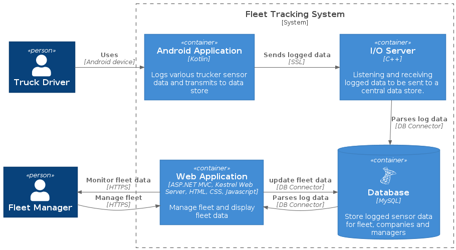

# **fleet-tracker - final year project**
a fleet tracking solution which allows fleet managers to manage and monitor their fleets.  
fleet managers can monitor their employees' live location, speed etc.

# **requirements**
an extract from the initial project description is given below.  

# **solution overview**

# **TODO**
in order of priority
## **android**
 - [ ] add local data store for user data persistence
 - [ ] unique trucker identifier with uuid
 - [ ] network protocol for user confirmation
 - [ ] implement better lifecycle and livedata control

## **android application**
### functionality
 - log sensor data every 2 minutes, that is:
    1. gps co-ordinates
    2. speed
    3. acceleration
    4. altitude(optional) - typically available from GPS system.
 - store in local caching database
 - send log data to server

### aspects
 - power usage and running in the background
 - permissions
 - ssl connection

## **i/o server**
### functionality
 - asynchronous serve multiple clients over ssl connection
 - relay log data to central database
### aspects
 - ssl server
 - ssl 3-way handshake and certificates
 - asynchronously server multiple clients