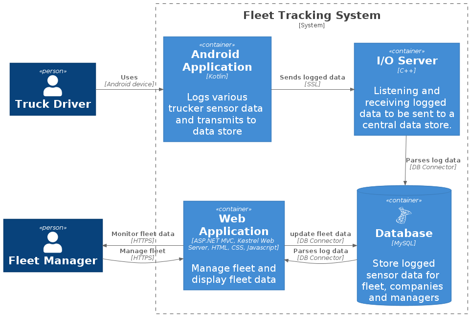
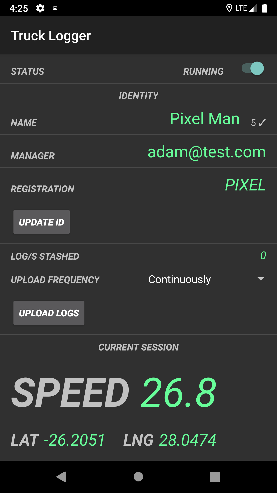
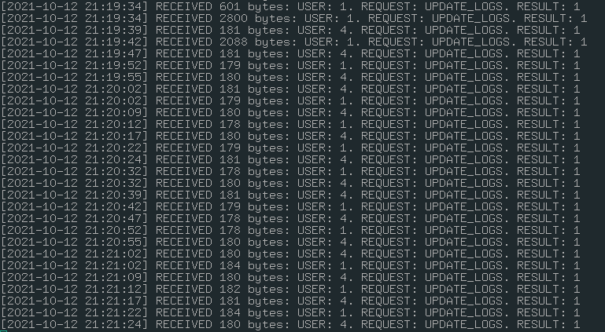
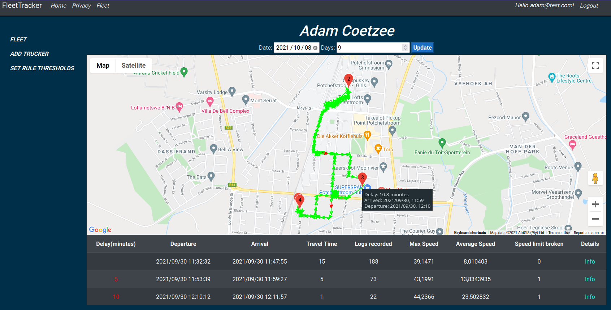

# **EERI 474 - 2021 Project**
# **Adam Coetzee - 29982995**
# **fleet-tracker**
A fleet tracking solution which allows trucking fleet managers to manage and monitor their fleets.  

**check /docs of for all main documents.**  
All the code/commits used in the project is provided here.
# **overview**

## **android application (kotlin) - TruckLogger**

## **i/o server (c++) - fleet-io**

## **web app (ASP.NET C#) - FleetTracker**

# **requirements**
an extract from the initial project description is given below.  

